<h1 align="center">
  Hi! 
</h1>

  <b>João Alves</b> 
  MSc in Informatics and Computing Engineering (FEUP) | Data Engineer & Analytics

  
  

---

## About me

I'm a MSc student at FEUP focused on turning data into clear, reproducible insights.  
I primarily work with **Python + SQL** for analysis and have experience with **IBM SPSS** and applied **machine learning** for modeling and interpretation.

Below is a visual overview of the technologies and domains I work with and continue to develop.

  

---

## Selected work

My work typically combines data exploration, modeling, and system-level implementation. Here are a few projects I’ve contributed to and found particularly interesting.

  

