<!-- 

  

 -->

<h1 align="center"> Hi </h1>

  <b>João Alves</b> 
  MSc in Informatics and Computing Engineering (FEUP) | Data Analytics & ML

<!-- Badges -->

  <!--  -->
  
  

---

## About me

I'm a MSc student at FEUP focused on turning data into clear, reproducible insights.
I work mainly with **Python + SQL** for analysis, and I have experience with **IBM SPSS** and applied a little **ML** to model and interpret results.

---

  

  

<!-- 

  

 -->

---

## Selected work

- **ExplicaME Startup:** matching engine to improve student–tutor compatibility, plus AI support during sessions.
- **Molecular & Protein Prediction:** substructure mining + predictive modeling.
- **Smart Energy Management:** telemetry + time-series monitoring (InfluxDB/Grafana) with forecasting.